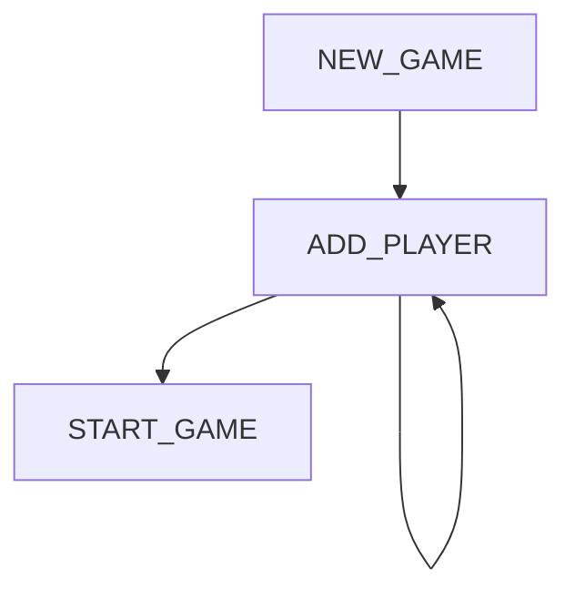

# YATHZALL

## Engine

### Rules

The rules are handled in a separate class

```TypeScript
type Dice = 1 | 2 | 3 | 4 | 5 | 6;
type DiceRoll = Dice[5];

interface IScoreItem {
  readonly name: string;
  accept(roll: DiceRoll): boolean;
}

interface IRuleSet {
  readonly name: string;
}

```

## User Interface

### Menus

When the application is loaded the following options should be presented :

* Continue game (if a pending game exists in the `localStorage`)
* New Game



### State

The current state of the game should be saved inside the `localStorage`. The goal is to make sure that when the page is reloaded, the game continue.

### Use of emoticons

#### Dices

Dices are represented with the following characters :

|Value|Emoji|Entity|
|---|---|---|
| 1 | ⚀ | &#9856; |
| 2 | ⚁ | &#9857; |
| 3 | ⚂ | &#9858; |
| 4 | ⚃ | &#9859; |
| 5 | ⚄ | &#9860; |
| 6 | ⚅ | &#9861; |

#### Players

Players can choose an animal emoji to represent them :

|Animal|Emoji|Entity|
|---|---|---|
| Dragon | 🐲 | &#128050; |
| Cat | 🐱 | &#128049; |
| Dog | 🐶 | &#128054; |
| Mouse | 🐭 | &#128045; |
| Koala | 🐨 | &#128040; |
| Tiger | 🐯 | &#128047; |
| Rabbit | 🐰 | &#128048; |
| ...
